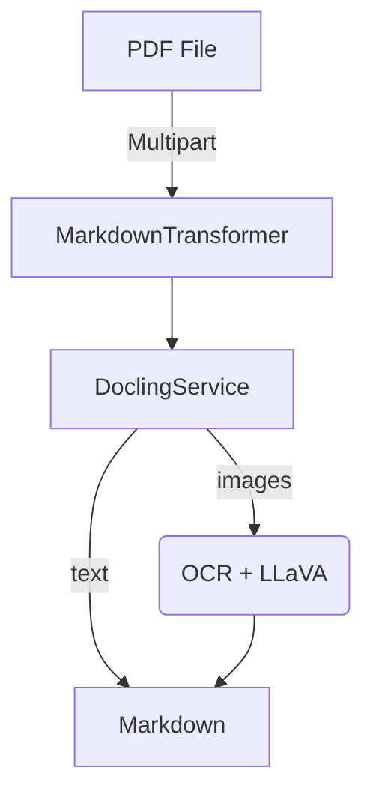

# alf-tengine-convert2md
[](pom.xml)
[](compose.yaml)
[](LICENSE)

AI‑powered Alfresco Transform Engine that converts PDF files to clean, richly‑described Markdown.

## Features

| Capability      | Details                                                                                                                       |
| --------------- | ----------------------------------------------------------------------------------------------------------------------------- |
| PDF to Markdown | Extracts text and layout, turning each page into Markdown                                                                     |
| Image captions  | Uses OCR **and** an LLaVA multimodal model (via [Ollama](https://ollama.ai)) to inject descriptive `![alt]` captions in‑line  |
| Alfresco‑ready  | Implements the Alfresco Transform Core SPI (`TransformEngine` & `CustomTransformer`)                                          |
| Containerised   | Multi‑stage Docker build (Java 17 + Python 3.11) with health‑check                                                            |
| Configurable    | All knobs live in `application.yml` or environment variables                                                                  |

## Quick start

### 1. Prerequisites

* Java 17 & Maven 3.9+ (for local builds)
* Docker (for running the service)
* An Ollama daemon exposing `llava` LLM on `http://localhost:11434`

```bash
ollama pull llava   # once
ollama serve        # or `ollama run llava` in another shell
```

### 2. Run with Docker Compose

```bash
git clone git@github.com:aborroy/alf-tengine-convert2md.git
cd alf-tengine-convert2md
docker compose up --build -d
```

*Service will be reachable at [http://localhost:8090](http://localhost:8090)*

Test it:

```bash
curl -X POST \
     -F "file=@/path/to/document.pdf" \
     "http://localhost:8090/transform?sourceMimetype=application/pdf&targetMimetype=text/markdown" \
     -o output.md
```

### 3. Build & run locally

```bash
mvn clean package -DskipTests
java -jar target/alf-tengine-convert2md-0.8.0.jar
```

The app listens on `:8090` by default.

## Configuration

| Property                                    | Default                  | Purpose                          |
| ------------------------------------------- | ------------------------ | -------------------------------- |
| `SPRING_AI_OLLAMA_BASE_URL`                 | `http://localhost:11434` | Endpoint for the Ollama REST API |
| `spring.servlet.multipart.max-file-size`    | `100MB`                  | Max upload size                  |
| `spring.servlet.multipart.max-request-size` | `100MB`                  | Max request size                 |

Edit `src/main/resources/application.yml` or supply env vars/`‑D` flags.

### Testing with the HTML Interface

After starting the service, open the test application at [http://localhost:8090](http://localhost:8090). Use the following input values:

- **file**: Upload an PDF file
- **sourceMimetype**: `application/pdf`
- **targetMimetype**: `text/markdown`

Click the **Transform** button to process the PDF file, the extracted metadata will be returned as a Markdown file

## Building the Docker Image

### Requirements

- Docker 4.30+

### Building the Image

From the project root directory, build the Docker image with:

```bash
docker build . -t alf-tengine-convert2md
```

This will create a Docker image named `alf-tengine-convert2md:latest` in your local Docker repository

## Deploying with Alfresco Community 25.x

Ensure your `compose.yaml` file includes the following configuration:

```yaml
services:
  alfresco:
    environment:
      JAVA_OPTS : >-
        -DlocalTransform.core-aio.url=http://transform-core-aio:8090/
        -DlocalTransform.md.url=http://transform-md:8090/

  transform-core-aio:
    image: alfresco/alfresco-transform-core-aio:5.1.7

  transform-md:
    image: alf-tengine-convert2md
```

Key Configuration Updates

- Add `localTransform.md.url` to the Alfresco service (`http://transform-md:8090/` by default)
- Define the `transform-md` service using the custom-built image

*Ensure you have built the Docker image (`alf-tengine-convert2md`) before running Docker Compose*

## Deploying with Alfresco Enterprise 25.x

Ensure your `compose.yaml` file includes the following configuration:

```yaml
services:
  alfresco:
    environment:
      JAVA_OPTS : >-
        -Dtransform.service.enabled=true
        -Dtransform.service.url=http://transform-router:8095
        -Dsfs.url=http://shared-file-store:8099/

  transform-router:
    image: quay.io/alfresco/alfresco-transform-router:4.1.7
    environment:
      CORE_AIO_URL: "http://transform-core-aio:8090"
      TRANSFORMER_URL_MD: "http://transform-md:8090"
      TRANSFORMER_QUEUE_MD: "markdown-engine-queue"

  transform-md:
    image: alf-tengine-convert2md
    environment:
      ACTIVEMQ_URL: "nio://activemq:61616"
      FILE_STORE_URL: >-
        http://shared-file-store:8099/alfresco/api/-default-/private/sfs/versions/1/file
```

Key Configuration Updates

- Register the Markdown transformer with `transform-router`
    - URL: `http://transform-md:8090/` (default)
    - Queue Name: `markdown-engine-queue` (defined in `application.yaml`)
- Define the `transform-md` service and link it to ActiveMQ and Shared File Store services

*Ensure you have built the Docker image (`alf-tengine-convert2md`) before running Docker Compose*

## Internals



* `MarkdownEngine` Declares the Alfresco Engine (`markdown`) and its capabilities
* `MarkdownTransformer` Streams the PDF to a temp file and invokes `DoclingService`
* `DoclingService`

    * Parses PDF with [Docling](https://pypi.org/project/docling/)
    * Describes embedded images via Spring AI using Ollama `llava`