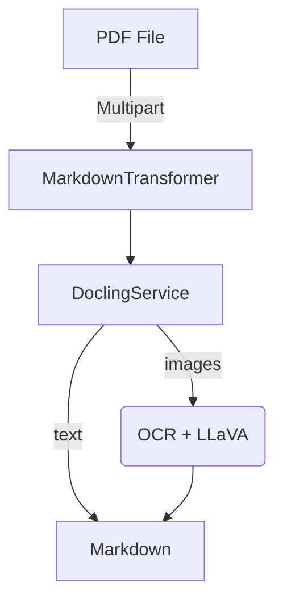

# alf-tengine-convert2md
[](pom.xml)
[](compose.yaml)
[](LICENSE)

AI‑powered Alfresco Transform Engine that converts PDF files to clean, richly‑described Markdown.

## Features

| Capability      | Details                                                                                                                       |
| --------------- | ----------------------------------------------------------------------------------------------------------------------------- |
| PDF to Markdown | Extracts text and layout, turning each page into Markdown                                                                     |
| Image captions  | Uses OCR **and** an LLaVA multimodal model (via [Ollama](https://ollama.ai)) to inject descriptive `![alt]` captions in‑line  |
| Alfresco‑ready  | Implements the Alfresco Transform Core SPI (`TransformEngine` & `CustomTransformer`)                                          |
| Containerised   | Multi‑stage Docker build (Java 17 + Python 3.11) with health‑check                                                            |
| Configurable    | All knobs live in `application.yml` or environment variables                                                                  |

## Quick start

### 1. Prerequisites

* Java 17 & Maven 3.9+ (for local builds)
* Docker (for running the service)
* An Ollama daemon exposing `llava` LLM on `http://localhost:11434`

```bash
ollama pull llava   # once
ollama serve        # or `ollama run llava` in another shell
```

### 2. Run with Docker Compose

```bash
git clone git@github.com:aborroy/alf-tengine-convert2md.git
cd alf-tengine-convert2md
docker compose up --build -d
```

*Service will be reachable at [http://localhost:8090](http://localhost:8090)*

Test it:

```bash
curl -X POST \
     -F "file=@/path/to/document.pdf" \
     "http://localhost:8090/transform?sourceMimetype=application/pdf&targetMimetype=text/markdown" \
     -o output.md
```

### 3. Build & run locally

```bash
mvn clean package -DskipTests
java -jar target/alf-tengine-convert2md-0.8.0.jar
```

The app listens on `:8090` by default.

## Configuration

| Property                                    | Default                  | Purpose                          |
| ------------------------------------------- | ------------------------ | -------------------------------- |
| `SPRING_AI_OLLAMA_BASE_URL`                 | `http://localhost:11434` | Endpoint for the Ollama REST API |
| `spring.servlet.multipart.max-file-size`    | `100MB`                  | Max upload size                  |
| `spring.servlet.multipart.max-request-size` | `100MB`                  | Max request size                 |

Edit `src/main/resources/application.yml` or supply env vars/`‑D` flags.

## Internals



* `MarkdownEngine` Declares the Alfresco Engine (`markdown`) and its capabilities
* `MarkdownTransformer` Streams the PDF to a temp file and invokes `DoclingService`
* `DoclingService`

    * Parses PDF with [Docling](https://pypi.org/project/docling/)
    * Describes embedded images via Spring AI using Ollama `llava`